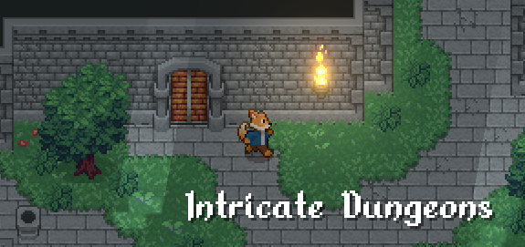
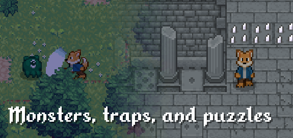
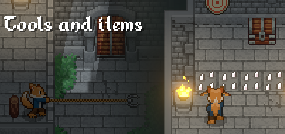
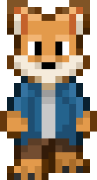

# Ancient Mind

Explore a region of mystery and danger in Ancient Mind, a modern take on the classic zelda-like top-down action adventure. Explore dungeons, fight monsters, solve puzzles, and discover the truth about ancient legends.

[Wishlist on Steam](https://store.steampowered.com/app/2376750/Ancient_Mind/)

[Join the Discord!](https://discord.com/invite/7KZxGvD6cU)

### Info

Developer: [HexagonNico](https://hexagonnico.github.io)

Planned release date: November 2024

Platforms: Windows, MacOS, Linux, Android

## Index

* [Screenshots](#screenshots)
* [About the game](#about-the-game)
* [Graphical assets](#graphical-assets)
* [Download press kit](#download-press-kit)

## Screenshots

## About the game

Explore a region of mystery and danger in Ancient Mind, a modern take on the classic zelda-like top-down action adventure. Explore dungeons, fight monsters, solve puzzles, and discover the truth about ancient legends.

This game will put your spacial awareness to the test with a sequence of environmental puzzles, levels characterized by a non-linear structure made of keys and locks, dungeons full of monsters, traps, and riddles. Even with a map, you will still need to pay close attention to your surroundings if you want to find your way to the end safe and sound.

Ancient Mind is a modern take on the classic top-down action adventure. Fight monsters with your sword and use tools such as a grappling hook and torches to overcome obstacles and reach new areas. Items like bows and arrows are not only useful in combat, but also for triggering mechanisms in ancient temples. You will find new items as you progress into the game, unlocking paths even in already explored areas.

Legends tell many stories about these lands, stories about an uncertain past. This region was once inhabited by an ancient civilization that now appears to have vanished into thin air, leaving behind nothing but ruins. Will you find the answers you're looking for? There might be clues behind every corner.

## Graphical assets

### Logo

### Wide cover

### Main capsule

### Header capsule

### Main character

## Download press kit

Click here to download Ancient Mind's press kit as a `.zip` file.
