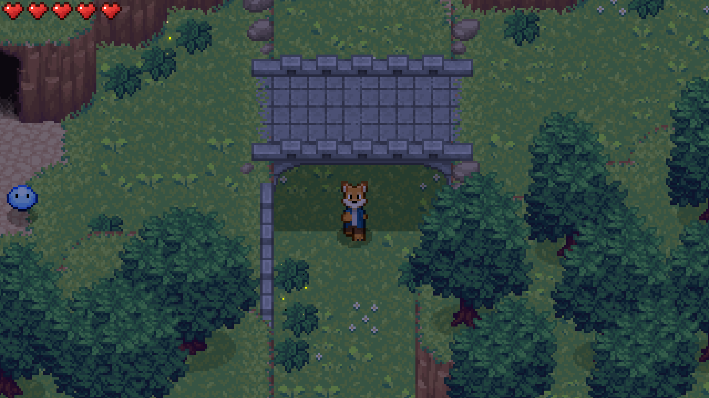
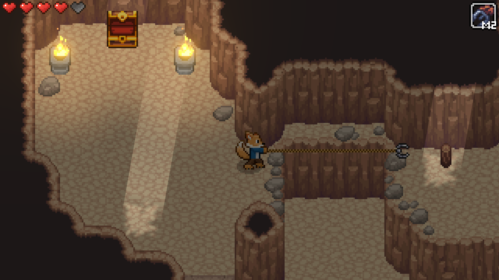
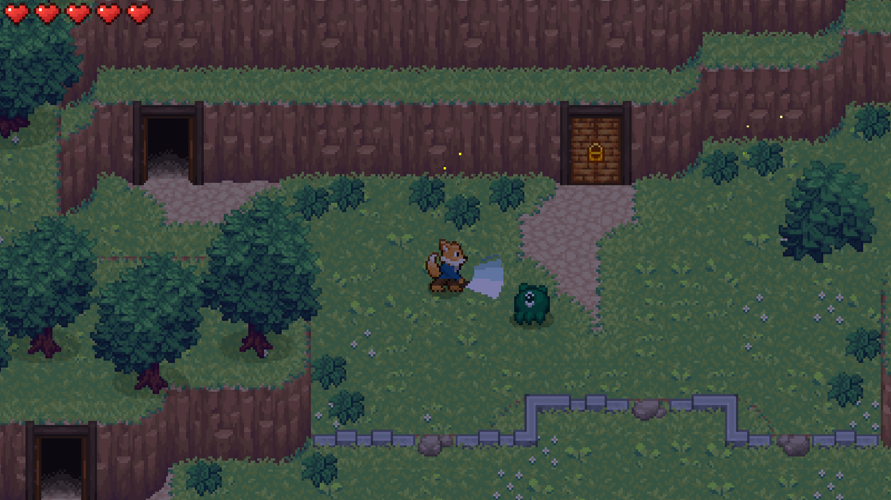
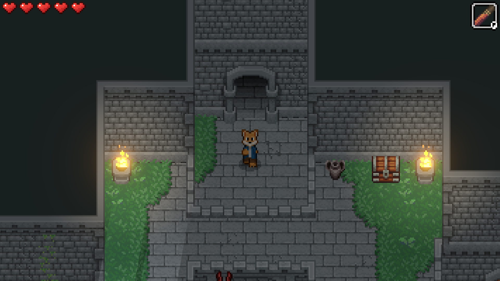
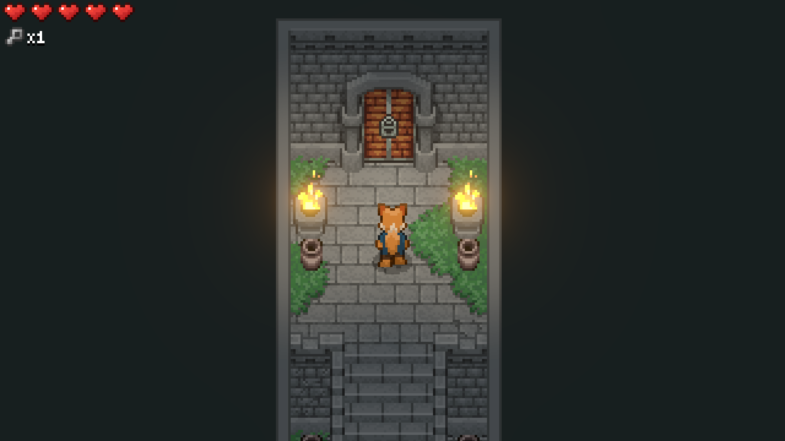
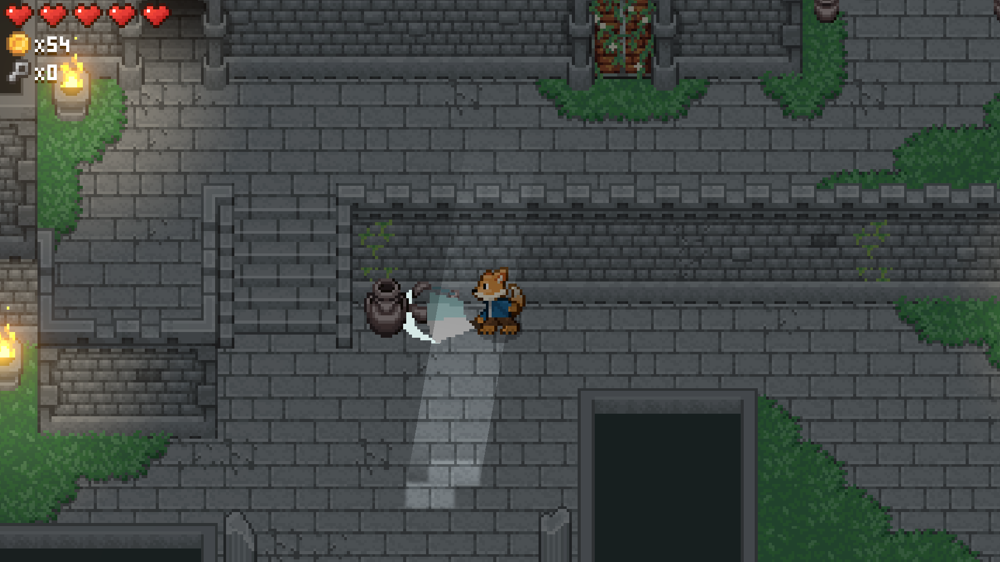
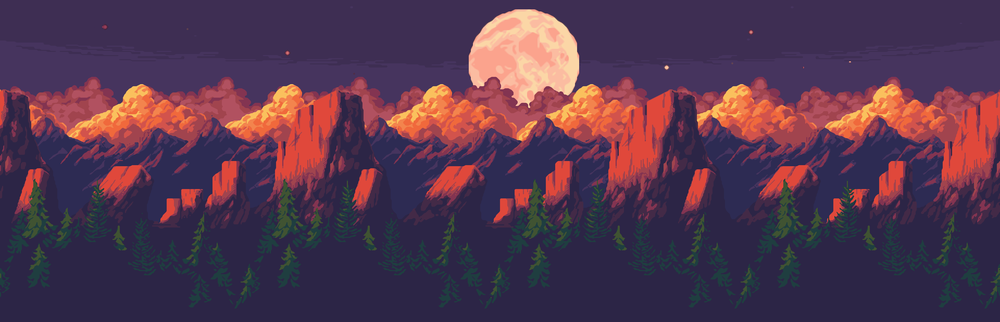
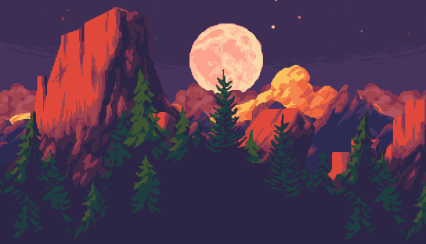
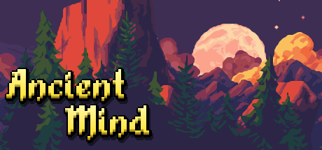

# Ancient Mind

Explore a region of mystery and danger in Ancient Mind, a modern take on the classic zelda-like top-down action adventure. Explore dungeons, fight monsters, solve puzzles, and discover the truth about ancient legends.

[Wishlist on Steam](https://store.steampowered.com/app/2376750/Ancient_Mind/)

[Join the Discord!](https://discord.com/invite/7KZxGvD6cU)

### Info

Developer: [HexagonNico](https://hexagonnico.github.io)

Characters art by [Snow](https://twitter.com/snowdowo)

Planned release date: November 2024

Platforms: Windows, MacOS, Linux, Android

## Index

* [Screenshots](#screenshots)
* [About the game](#about-the-game)
* [Graphical assets](#graphical-assets)
* [Download press kit](#download-press-kit)

## Screenshots

## About the game

Ancient Mind is a Zelda-inspired action-adventure game about exploring a region full of ruins where an ancient civilization once lived.

The game follows a classic level-based structure where every levels can be selected from the world map.
New levels can be unlocked by completing the previous ones or by finding secret exits.
Every level can be replayed an indefinite amount of times.

Finding all secrets is not required to finish the levels, but finding all chests will reward the player with a gem at the end of the level that will be needed to unlock some paths to progress in the game.

### Key features

* A sequence of levels, referred to as "Dungeons", characterized by a non-linear structure. Getting to the end requires a good spatial awareness.
* Top-down 2d exploration that also makes use of the third dimension.
* Several puzzles to solve in every level to unlock new paths (and sometimes block off others).
* An intriguing story told not through dialogues, but through hidden clues and environmental storytelling.

## Graphical assets

### Logo

### Wide cover

### Main capsule

### Header capsule

### Library capsule

### Small capsule

### Characters

### Steam Next Fest promo images

## Download press kit

Click [here](https://github.com/AncientMindGame/.github/archive/refs/heads/main.zip) to download Ancient Mind's press kit as a `.zip` file.
