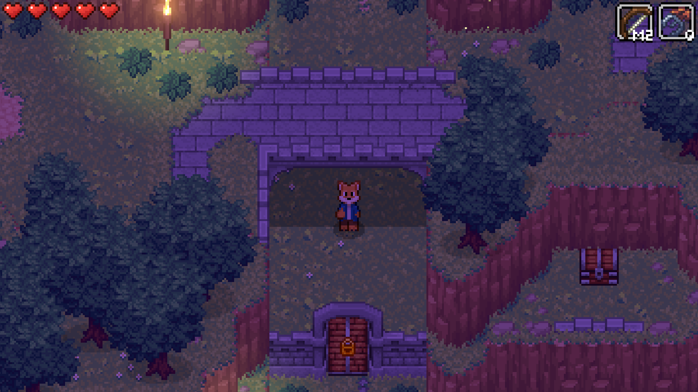
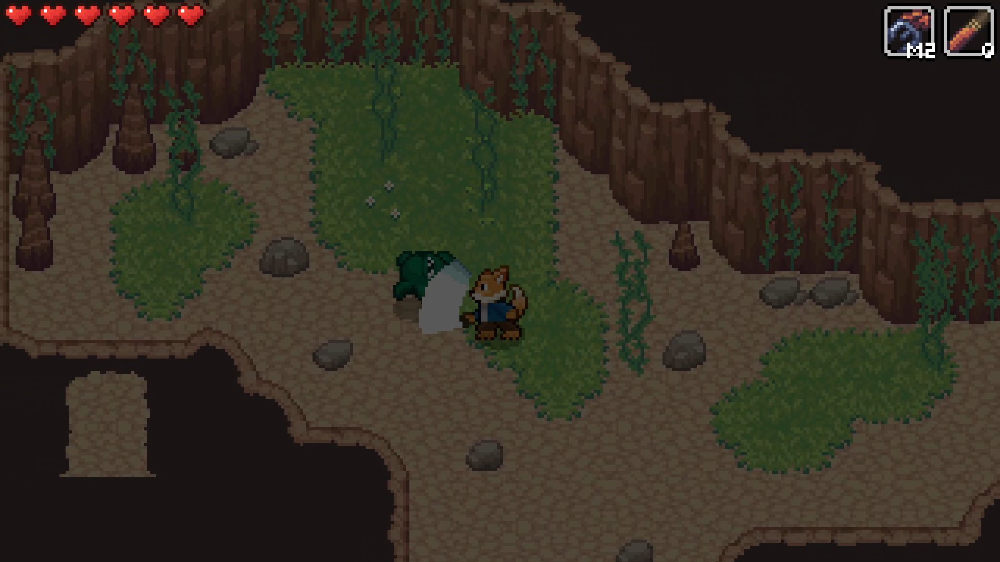
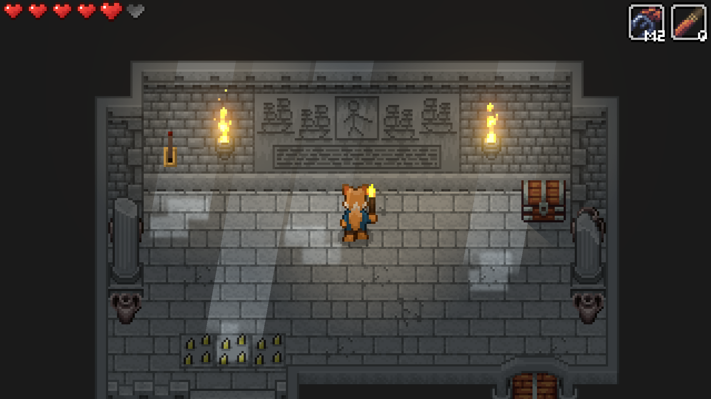
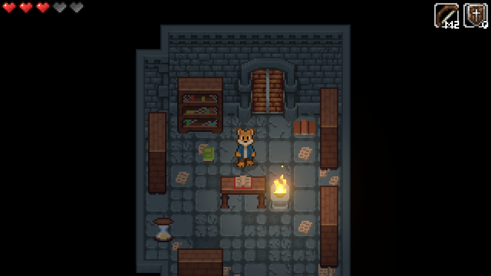
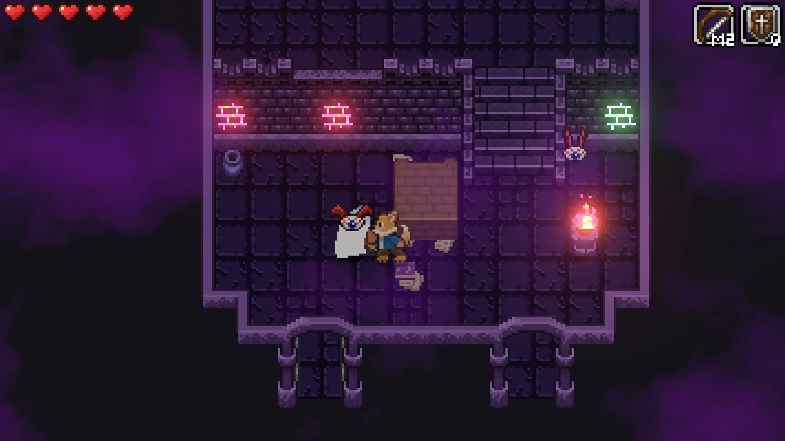
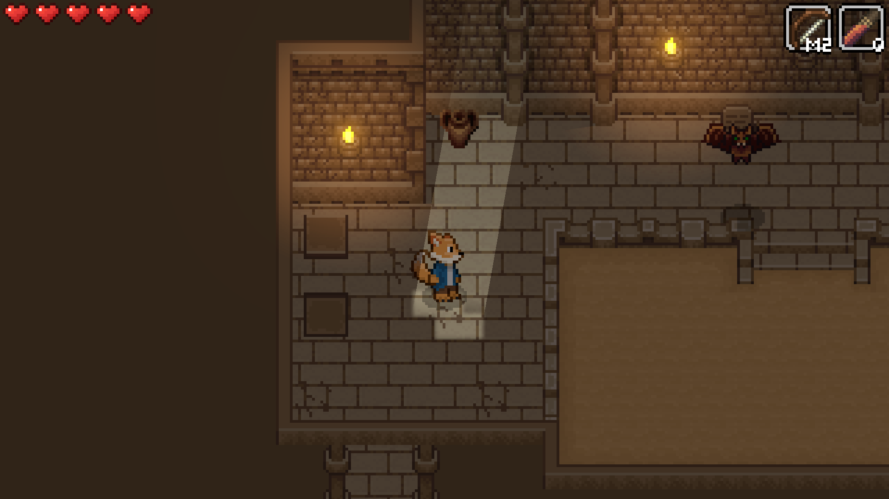
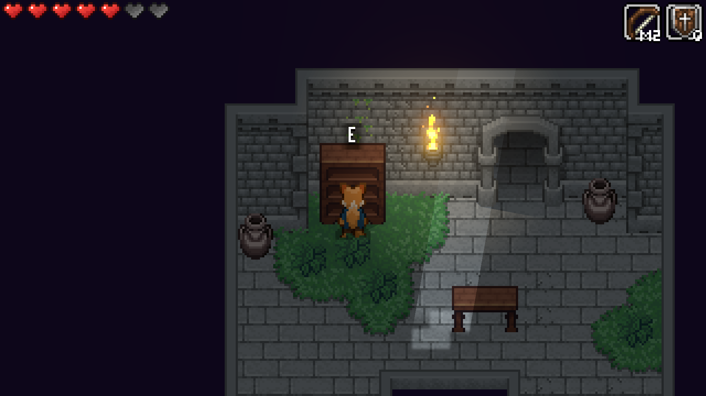
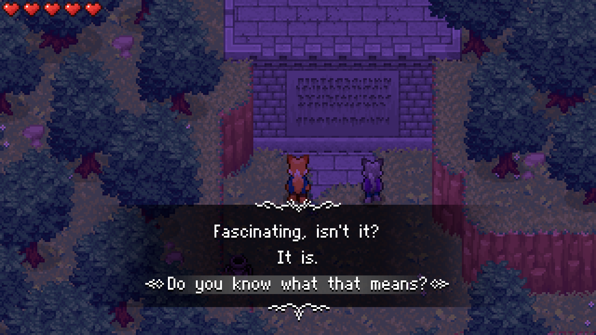

# Ancient Mind

Explore a region of mystery and danger in Ancient Mind, a modern take on the classic zelda-like top-down action adventure. Explore dungeons, fight monsters, solve puzzles, and discover the truth about ancient legends.

[Wishlist on Steam](https://store.steampowered.com/app/2376750/Ancient_Mind/)

[Join the Discord!](https://discord.com/invite/7KZxGvD6cU)

### Info

Developed by [HexagonNico](https://hexagonnico.github.io)

Music by [Hitctrl](https://opengameart.org/users/hitctrl) and [Matthew Pablo](https://opengameart.org/users/matthew-pablo) (CC BY-3.0)

Characters art by [Snow](https://twitter.com/snowdowo)

Planned release date: November 2024

Platforms: Windows, MacOS, Linux, Android

## Index

* [Screenshots](#screenshots)
* [About the game](#about-the-game)
* [Graphical assets](#graphical-assets)
* [Trailers](#trailers)
* [Download press kit](#download-press-kit)

## Screenshots

## About the game

Ancient Mind is a Zelda-inspired action-adventure game about exploring a region full of ruins where an ancient civilization once lived.

The game follows a classic level-based structure where every levels can be selected from the world map.
New levels can be unlocked by completing the previous ones or by finding secret exits.
Every level can be replayed an indefinite amount of times.

Every level is characterized by a non-linear structure.
The player must find keys, open locked doors, and solve puzzles to progress.
It will often be necessary to make a mental map of the level and remember which rooms have already been visited and which haven't to solve said puzzles.

Finding all secrets is not required to finish the levels, but finding all chests will reward the player with a gem at the end of the level that will be needed to unlock some paths to progress in the game.

Hidden throughout the world are several clues that will give the player additional information about the story.

### Key features

* A sequence of levels, referred to as "Dungeons", characterized by a non-linear structure. Getting to the end requires a good spatial awareness.
* Top-down 2d exploration that also makes use of the third dimension.
* Several puzzles to solve in every level to unlock new paths (and sometimes block off others).
* An intriguing story told not through dialogues, but through hidden clues and environmental storytelling.

### Story

*Long ago, the region of Carduelis was divided into six kingdoms, each ruled by a king.*

*The kingdoms, despite not being openly at war, were often at odds with each other.*

*However, their long-standing conflicts were put on hold when an unknown threat came from the sea.*

*The six kings realised that they needed to put their differences aside to fight the people of the sea, forming the first and only hexarchy of history.*

*For many days, the battle raged on, but its outcome is still unknown, since the kingdoms seem to have disappeared into nowhere soon after.*

*Historical records of the time tell of how the two peoples fought, but nothing has ever been found from the later period.*

*Due to its harsh territory, the region of Carduelis has been uninhabited since then. Of the six kingdoms nothing remains but ruins.*

*Many questions remain unanswered about what happened to the kingdoms and how they disappeared without a trace.*

*In recent times, many have ventured into the region in search of answers, but without success.*

*Despite this, the mystery continues to attract the curiosity of the inhabitants of the neighbouring regions.*

## Graphical assets

### Logo

### Wide cover

### Main capsule

### Header capsule

### Library capsule

### Small capsule

### Characters

### Steam Next Fest promo images

## Trailers

* Game reveal teaser (18 December 2022) - [Youtube](https://www.youtube.com/watch?v=u82zEPHnpls)
* First demo trailer (4 April 2023) - [Youtube](https://www.youtube.com/watch?v=MSd1eGzXrYs)
* Steam Next Fest trailer (8 December 2023) - [Youtube](https://www.youtube.com/watch?v=luqlCHRiCNg)

## Download press kit

Click [here](https://github.com/AncientMindGame/.github/archive/refs/heads/main.zip) to download Ancient Mind's press kit as a `.zip` file.
